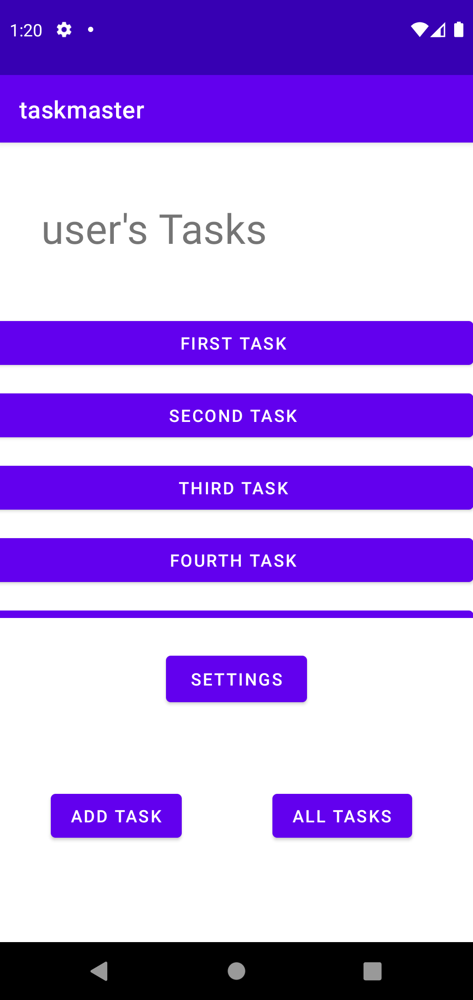

# taskmaster

* create a home page which has a three tasks buttons and settings button and (add task , all tasks) buttons.
* create an add task page which has two fields (title , description)  .
* add buttons which shows a message of submitted.
* create an all tasks page which has an image .
* create a back button to navigate you back to the home page.

## Home page :

## Add Task page :

## All Task page :

# settings page :

# Lorem1 page :

# Lorem2 page :

# Lorem1 page :
